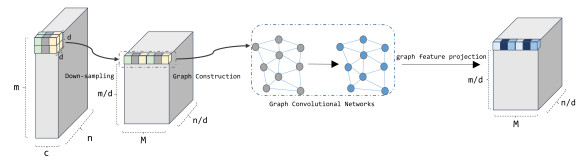

# VGU-Net
This is a repository for the paper [Vision graph U-Net: Geometric learning enhanced encoder for medical image segmentation and restoration](https://www.aimsciences.org/article/doi/10.3934/ipi.2023049)
## Main Contribution
The VGU-Net is a new designed back-bone model using multi-scale graph structure of image, where graph topology is dynamically constructed with attention mechanism to capture long-range self-similarity. The main vgunet model is in VGUNet.py, you can use it for different image processing tasks.



## Below is a brief instruction of implementing VGU-Net model on BRaTS 2018 segmentation dataset

### Download BraTS 2018 file for training and 2019 for testing:

Put the corresponding file in ./datasets directory


### Preprocssing training dataset:

```
python3 ./datasets/GetTrainingSets.py
```
Preprocssing testing dataset:

```
python3 ./datasets/GetTestingSetsFrom2019.py
```
### Training the model:

For multi-gpu training
```
CUDA_VISIBLE_DEVICES=0,1 python3 -m torch.distributed.launch --nproc_per_node=2 train.py  train --name vgunet
```

### Make prediction:
```
CUDA_VISIBLE_DEVICES=0 python3 test.py --name vgunet
```
